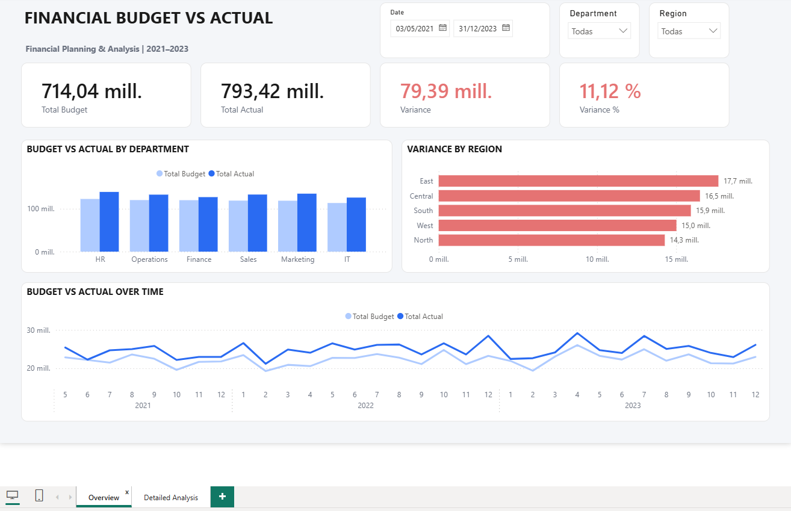
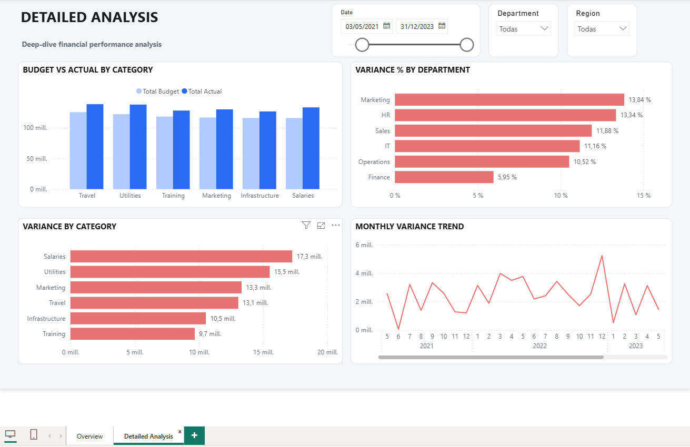
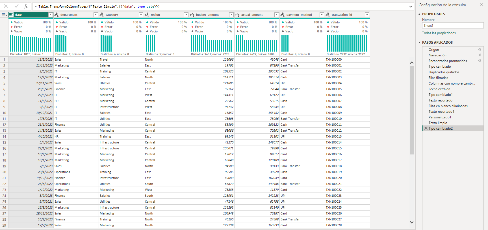
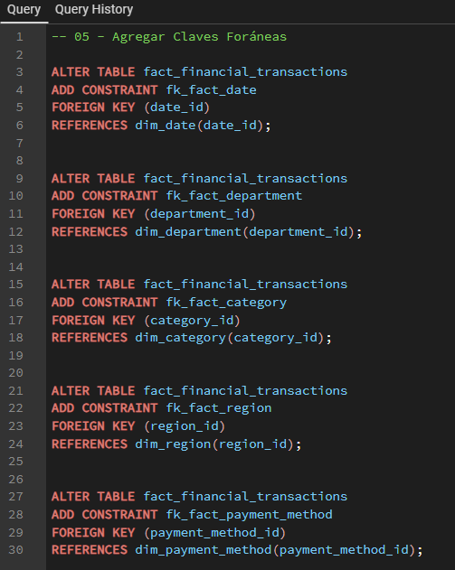
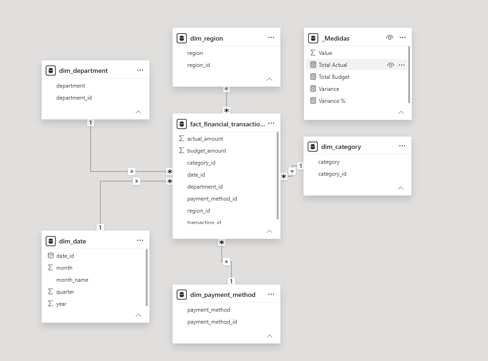
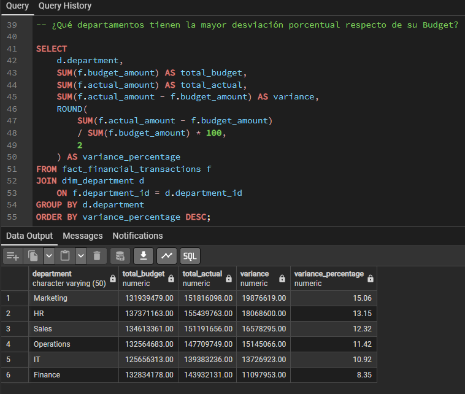
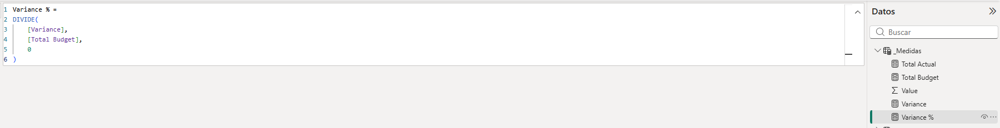

# Financial Budget vs Actual | FP&A Analysis

Proyecto end-to-end de análisis financiero enfocado en **Budget vs Actual / FP&A**, integrando Power Query, PostgreSQL, SQL, Power BI y DAX.

## Dashboard

### Executive Overview



### Detailed Analysis




## Objetivo del proyecto

El objetivo principal del proyecto es analizar la ejecución presupuestaria de una organización y comparar los importes presupuestados frente a los valores reales, identificando desvíos relevantes y patrones de sobre-ejecución.

A partir de este análisis se busca:

- Comparar **Budget vs Actual** a nivel global.
- Identificar departamentos con mayores desvíos presupuestarios.
- Analizar la variación por categoría de gasto.
- Evaluar diferencias entre regiones.
- Analizar la evolución mensual del presupuesto y los valores reales.
- Detectar patrones recurrentes de desviación presupuestaria.
- Generar insights y recomendaciones útiles para un contexto de **Financial Planning & Analysis (FP&A)**.

---

## Dataset y fuente de datos

El proyecto utiliza un dataset educativo de **Budget vs Actual** obtenido de Kaggle, con información financiera correspondiente al período **2021–2023**.

El archivo original contiene información a nivel transaccional con las siguientes variables:

- `Date`
- `Department`
- `Category`
- `Region`
- `Budget Amount`
- `Actual Amount`
- `Payment Method`
- `Transaction ID`

El dataset permite analizar la ejecución presupuestaria desde distintas dimensiones del negocio, como departamento, categoría de gasto, región y período.

Durante la etapa de preparación se detectaron registros duplicados, valores vacíos y campos que requerían estandarización antes de ser utilizados en el análisis.

Luego del proceso de limpieza, el dataset final quedó compuesto por **9.992 registros válidos**.

---

## Limpieza y transformación de datos

La preparación de los datos se realizó en **Power Query**, antes de cargar la información en PostgreSQL.

Durante el proceso ETL se realizaron las siguientes tareas:

- Revisión y corrección de tipos de datos.
- Conversión de la columna de fecha al tipo `Date`.
- Eliminación de registros duplicados.
- Filtrado de valores nulos o vacíos.
- Estandarización de nombres de columnas.
- Limpieza de campos de texto mediante recorte de espacios.
- Conversión de `budget_amount` y `actual_amount` a tipo decimal fijo.
- Validación de calidad de datos para verificar ausencia de errores y valores vacíos.

Las columnas finales utilizadas fueron:

- `date`
- `department`
- `category`
- `region`
- `budget_amount`
- `actual_amount`
- `payment_method`
- `transaction_id`

Una vez finalizada la limpieza, los datos fueron exportados a CSV para su posterior carga en PostgreSQL.



---

## Modelado de datos en PostgreSQL

Una vez finalizada la limpieza, el dataset fue cargado en **PostgreSQL** para estructurar la información en un modelo relacional orientado al análisis.

Primero se utilizó una tabla de staging:

- `financial_transactions_raw`

A partir de esa tabla se construyó un **modelo estrella (Star Schema)** compuesto por una tabla de hechos y cinco dimensiones.

### Tabla de hechos

`fact_financial_transactions`

Incluye:

- `transaction_id`
- `date_id`
- `department_id`
- `category_id`
- `region_id`
- `payment_method_id`
- `budget_amount`
- `actual_amount`

### Dimensiones

- `dim_date`
- `dim_department`
- `dim_category`
- `dim_region`
- `dim_payment_method`

La tabla de hechos se relaciona con cada dimensión mediante claves foráneas, permitiendo analizar las métricas financieras desde distintas perspectivas del negocio.

Luego de cargar el modelo se validaron:

- Cantidad de registros.
- Integridad de las relaciones.
- Coincidencia de totales de Budget y Actual entre staging y tabla de hechos.

La tabla de hechos quedó compuesta por **9.992 transacciones**.

### Implementación de claves foráneas en SQL



### Modelo estrella



---

## Análisis SQL

Con el modelo relacional ya construido en PostgreSQL, se desarrollaron consultas SQL orientadas a responder preguntas clave de negocio vinculadas al análisis presupuestario.

Los principales análisis realizados fueron:

1. **Budget vs Actual total**
   - Comparación entre presupuesto total y gasto real.
   - Cálculo de la variación absoluta.

2. **Variance por departamento**
   - Identificación de las áreas con mayor desvío presupuestario.

3. **Variance por categoría**
   - Análisis de las categorías de gasto con mayor impacto sobre la desviación total.

4. **Variance % por departamento**
   - Comparación relativa de los desvíos respecto del presupuesto asignado.

5. **Evolución mensual de Budget vs Actual**
   - Análisis temporal del comportamiento presupuestario durante 2021–2023.

6. **Variance por región**
   - Comparación de los desvíos presupuestarios entre regiones.

Las consultas incluyeron agregaciones, `JOIN`, cálculos de variación y agrupaciones por dimensiones del modelo.



---

## Power BI y medidas DAX

El modelo desarrollado en PostgreSQL fue conectado directamente a **Power BI**, importando únicamente la tabla de hechos y las dimensiones necesarias para el análisis.

Sobre este modelo se creó una tabla dedicada de medidas (`_Medidas`) y se desarrollaron los principales indicadores financieros mediante DAX:

```DAX
Total Budget =
SUM(fact_financial_transactions[budget_amount])
```

```DAX
Total Actual =
SUM(fact_financial_transactions[actual_amount])
```

```DAX
Variance =
[Total Actual] - [Total Budget]
```

```DAX
Variance % =
DIVIDE(
    [Variance],
    [Total Budget],
    0
)
```

Estas medidas permiten que todos los indicadores y visualizaciones respondan dinámicamente a los filtros aplicados por fecha, departamento y región.



---

## Dashboards en Power BI

Se desarrollaron dos páginas complementarias en Power BI para separar la visión ejecutiva del análisis detallado.

### Executive Overview

La primera página resume el desempeño financiero general mediante:

- Total Budget.
- Total Actual.
- Variance.
- Variance %.
- Budget vs Actual por departamento.
- Variance por región.
- Evolución temporal de Budget vs Actual.

Además, incorpora filtros interactivos por fecha, departamento y región.


### Detailed Analysis

La segunda página profundiza en los desvíos presupuestarios mediante:

- Budget vs Actual por categoría.
- Variance % por departamento.
- Variance por categoría.
- Evolución mensual de la Variance.

Esta vista permite identificar con mayor precisión qué áreas y categorías concentran los principales desvíos.


---

## Insights principales

A partir del análisis realizado en SQL y Power BI se identificaron los siguientes hallazgos:

- La organización presenta una **Variance total de 79,39 millones**, equivalente a un **11,12% por encima del presupuesto**.
- El desvío es generalizado: todos los departamentos, regiones y categorías analizadas presentan valores de Actual superiores al Budget.
- **Marketing** registra la mayor Variance % entre departamentos, con **13,84%**, seguido por **HR con 13,34%**.
- **Finance** presenta el menor desvío relativo, con **5,95%**.
- Las categorías con mayor Variance absoluta son **Salaries (17,3M)** y **Utilities (15,5M)**, que en conjunto representan más del **41% del desvío total**.
- A nivel regional, **East** presenta la mayor Variance con **17,7M**, mientras que **North** registra la menor con **14,3M**.
- El mayor desvío mensual del período se observa en **diciembre de 2022**, con una Variance de **5,240M**.
- El comportamiento temporal muestra que Actual se mantiene recurrentemente por encima del Budget, lo que indica que los desvíos no se concentran únicamente en períodos aislados.

---

## Recomendaciones de negocio

A partir de los desvíos identificados, se proponen las siguientes líneas de acción:

- Revisar las premisas utilizadas para elaborar el presupuesto, incorporando con mayor peso el comportamiento histórico observado.
- Priorizar el seguimiento de **Marketing** y **HR**, por presentar los mayores desvíos porcentuales.
- Profundizar el análisis de **Salaries** y **Utilities**, dado su peso sobre la Variance total.
- Implementar un monitoreo periódico de **Variance** y **Variance %** por departamento, categoría y región.
- Analizar los meses con mayores picos de desvío para identificar los factores operativos que explican esas variaciones.
- Utilizar los resultados del análisis como apoyo para futuros procesos de planificación, forecast y control presupuestario.

---

## Conclusión

Este proyecto permitió desarrollar un flujo completo de análisis financiero, desde la preparación y transformación de datos hasta la construcción de un modelo dimensional, el análisis con SQL y la visualización interactiva en Power BI.

El análisis evidenció un patrón generalizado de sobre-ejecución presupuestaria, con una Variance total de **79,39 millones** y un desvío del **11,12%** sobre el presupuesto.

Además de identificar los principales focos de desviación por departamento, categoría, región y período, el proyecto demuestra cómo combinar herramientas de **Data Analytics** con conceptos de **FP&A** para generar información útil para el seguimiento y control presupuestario.

---

## Estructura del repositorio

```text
Financial-Budget-vs-Actual/
│
├── data/
│   ├── financial_data_raw.xlsx
│   └── financial_data_clean.csv
│
├── sql/
│   ├── 01_crear_tablas.sql
│   ├── 02_cargar_dimensiones.sql
│   ├── 03_crear_tabla_hechos.sql
│   ├── 04_cargar_tabla_hechos.sql
│   ├── 05_agregar_claves_foraneas.sql
│   └── 06_analisis_negocio.sql
│
├── powerbi/
│   └── financial_budget_vs_actual_fp&a.pbix
│
├── images/
│   ├── power_query_etl.png
│   ├── sql_foreign_keys.png
│   ├── data_model.png
│   ├── sql_analysis.png
│   ├── dax_measures.png
│   ├── executive_overview.png
│   └── detailed_analysis.png
│
└── README.md
```
